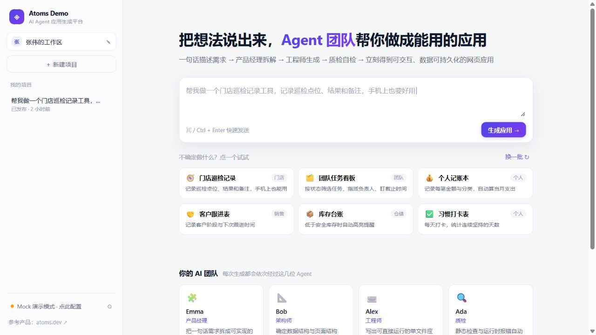
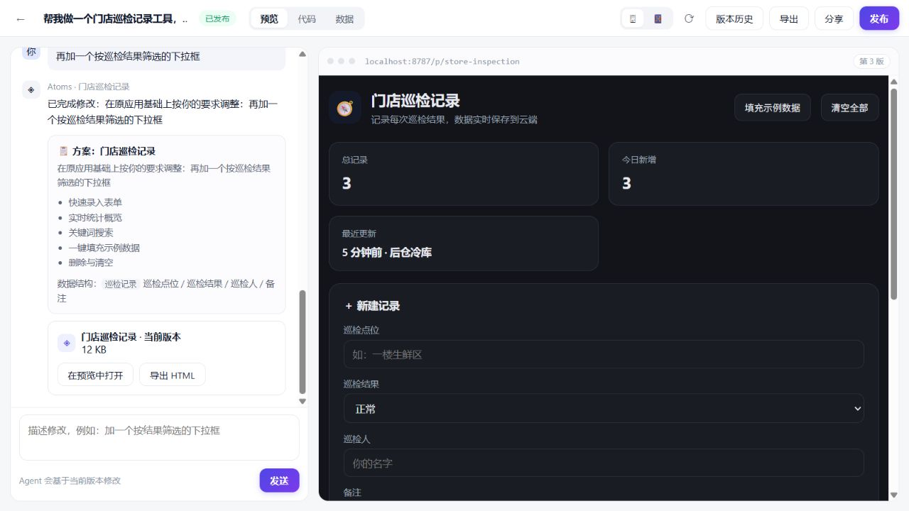
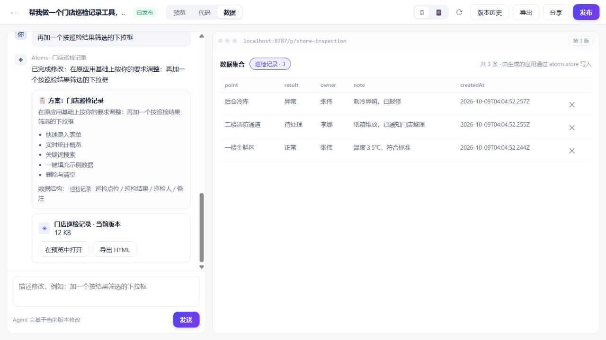
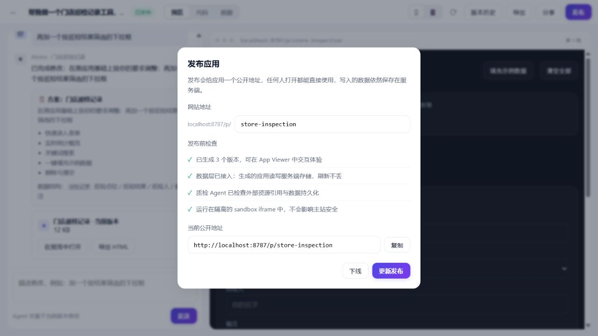
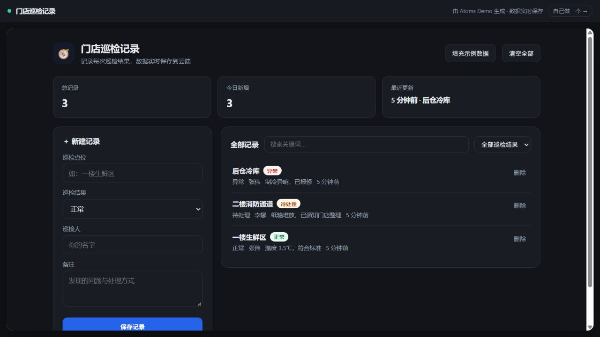
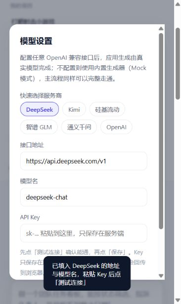
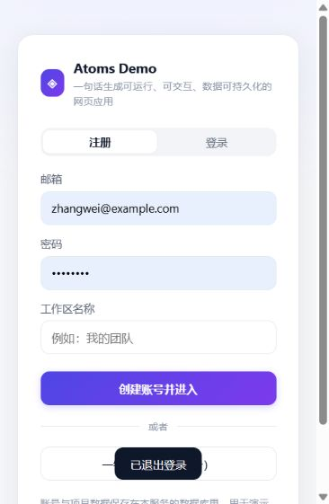
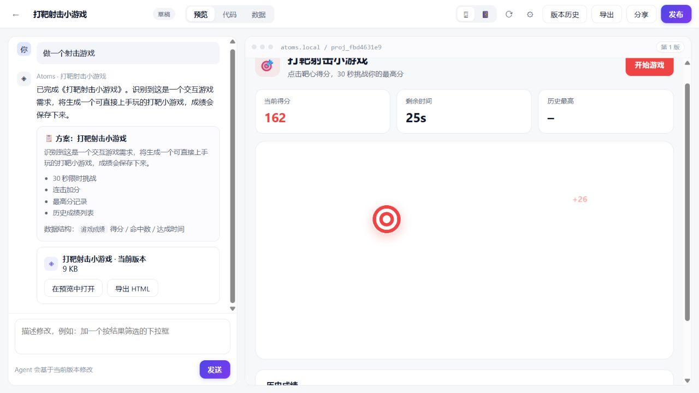
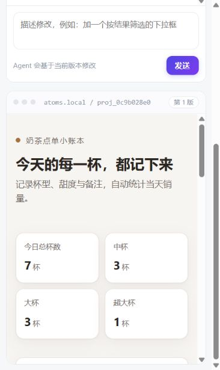

# Atoms Demo

> 用一句话把想法变成**可运行、可交互、数据可持久化**的网页应用：一支有名字的 AI 团队负责拆解、生成、质检，右侧 App Viewer 立刻就能点着用，随时发布成公开链接。

对标 [Atoms](https://atoms.dev/) 的产品形态（工作区 → 项目对话 → App Viewer → 发布公开链接），差异化的地方落在一点上：

**生成物不是一坨静态 HTML，而是自带数据层的真应用。** 生成出来的页面通过 `window.atoms.store()` 读写服务端数据，刷新不丢、分享给别人的链接打开也是同一份数据。

## 界面速览

| 工作台（WorkSpace） | 项目工作台（对话 + App Viewer） |
| --- | --- |
|  |  |

| 数据面板（生成物写入的真实数据） | 发布面板 |
| --- | --- |
|  |  |

| 发布后的公开页面 | |
| --- | --- |
|  | |

| 模型设置（界面内配置 API Key） | |
| --- | --- |
|  | |

| 注册 / 登录 / 一键体验 | |
| --- | --- |
|  | |

| 生成的小游戏（成绩会入库） | |
| --- | --- |
|  | |

| 真实模型生成的应用（DeepSeek） | |
| --- | --- |
|  | |

---

## 1. 快速开始

环境要求：**Node.js 24 及以上**（推荐；内置 `node:sqlite`，无需任何编译依赖）。项目**零第三方依赖，不需要 `npm install`**。

```bash
# 启动（不配置任何环境变量也能跑，会自动进入 Mock 演示模式）
node server.js
# 或
npm start
```

打开 http://localhost:8787 即可。

第一次进入会让你创建一个「工作区」（代替注册登录），然后在中间的大输入框里描述你想要的应用，例如：

> 帮我做一个门店巡检记录工具，记录巡检点位、结果和备注，手机上也要好用

## 2. 环境变量

### 想接真实模型？两种方式任选

**方式 A：界面里配（推荐，不用重启）**
工作台左下角「模型设置」（项目页右上角 ⚙ 也能进）→ 点一下服务商预设（DeepSeek / Kimi / 硅基流动 / 智谱 / 通义千问 / OpenAI）→ 粘贴 API Key → **先点「测试连接」再点「保存」**。配置存在数据库里，重启和重新部署都不丢。

**方式 B：环境变量**
复制 `.env.example` 为 `.env`，填好下面三项后重启服务。`.env.example` 里已经列好各家服务商的地址与模型名，取消注释即可。

| 变量 | 说明 | 默认 |
| --- | --- | --- |
| `LLM_BASE_URL` | 任意 OpenAI 兼容接口地址 | `https://api.openai.com/v1` |
| `LLM_API_KEY` | 不填则进入 Mock 演示模式 | 空 |
| `LLM_MODEL` | 模型名 | `gpt-4o-mini` |
| `LLM_MAX_TOKENS` | 生成代码的最大长度（多数服务商上限 8k） | `6000` |
| `PORT` | 服务端口 | `8787` |
| `STORAGE` | `sqlite` 或 `redis` | `sqlite` |
| `UPSTASH_REDIS_REST_URL` / `UPSTASH_REDIS_REST_TOKEN` | `STORAGE=redis` 时使用 | 空 |

> **也可以完全不动环境变量**：界面左下角「模型设置」（项目页右上角的 ⚙ 也能进）里填写接口地址、模型名和 API Key，保存后立即生效，配置存在数据库里。生效优先级：请求里的临时覆盖 > 界面配置 > 环境变量 > 默认值。
>
> Key 只在服务端保存，读取接口永远只返回掩码（如 `sk-te····cdef`）。**公开部署时请留意：任何访问者都能替换或消耗这个 Key**，正式产品需要配合鉴权与配额。

> 国内网络访问不了 `api.openai.com`，直接用 DeepSeek（`https://api.deepseek.com/v1` + `deepseek-chat`）最省事。各家接口都是 OpenAI 兼容格式，任何一家都能用。

> **模型选型建议**：写应用优先用**非推理模型**（如 `deepseek-chat`），实测首字 2 秒左右、20–45 秒产出一个 20KB+ 的完整应用。推理型模型（`deepseek-v4-flash`、`*-reasoner` 等）会把大量 token 花在思考上，更容易触达长度上限；系统对此做了两重兜底：正文为空时自动从思考内容里提取产物，输出被截断时让质检 Agent 精简重写。

> 连接出问题时用 `node tools/diag-llm.mjs` 逐项定位（地址对不对、模型名对不对、Key 有没有效），用 `node tools/debug-stream.mjs` 看模型原始返回的流结构。两个脚本都不会打印 Key 原文。

接好之后，用下面这条命令跑一次真实模型的全链路验收（会打印首字延迟、总耗时，并检查产物是否调用数据层、是否引用外链资源）：

```bash
node tools/test-live.mjs
node tools/test-live.mjs --autofix          # 额外验证"运行时错误 → 自动修复"
node tools/test-live.mjs --prompt="做一个健身房课程预约工具"
```

> **Mock 演示模式**：没有 API Key 时，内置生成器按需求关键词分三类产出**真实可交互、真实调用数据层**的单文件应用：
> - **数据台账类**：门店巡检 / 团队任务 / 记账 / 客户跟进 / 库存 / 习惯打卡 …（含通用台账兜底）；
> - **小游戏类**：射击打靶小游戏（限时挑战、连击加分、成绩入库、历史排行）；
> - **展示站点类**：官网 / 落地页 / 作品集（主视觉 + 服务介绍 + 预约留言表单）。
>
> 明确超出范围的需求（视频、文档、音频、原生 App、聊天机器人等）会**如实说明做不了**，并给出「去配置模型」的入口 —— 不会硬编一个不相干的应用忽悠人。

## 3. 核心流程

```
用户一句话需求
      │
      ├─ 🧩 Emma 产品经理 + 📐 Bob 架构师   一次调用产出方案与数据结构
      │
      ├─ ⌨️ Alex 工程师                     流式产出完整单文件应用（打字机效果）
      │
      ├─ 🔍 Ada 质检                        静态规则校验，不通过则自动修复一轮
      │
      ├─ App Viewer 实时渲染（桌面 / 手机）
      │       └─ 用户在应用里操作的每一条数据 → postMessage → 服务端存储
      │
      ├─ 继续对话迭代  →  生成新版本（版本历史可回滚）
      │
      └─ 发布  →  /p/<slug> 公开地址（任何人可用，数据共享）
```

运行期如果生成物抛错，桥接层会把报错回传给宿主，触发 Ada 的**第二轮修复**并生成新版本 —— 这是「自检」真正落地的地方。

## 4. 关键设计取舍

**① 产物统一成「单文件 HTML」**
生成物只允许是一个自包含的 HTML（内联 CSS/JS，禁止任何外链资源）。一个决定同时解决四件事：预览就是 iframe 渲染、持久化就是存一个字符串、分享就是把它吐出来、导出就是一个能双击运行的文件。代价是复杂应用做不了多文件工程 —— 对这个 Demo 的规模来说，收益远大于代价。

**② 生成物自带数据层（本项目的核心亮点）**
宿主在渲染前往 HTML 中注入一段运行时 SDK，生成物调用 `window.atoms.store('集合名')` 就能读写真正的数据库。这条链路让「AI 生成的页面」从演示品变成了可用的小工具：

```
生成物 (sandbox iframe, 独立源)
   └─ window.atoms.store('巡检记录').insert({...})
        └─ postMessage ─────────────► 宿主页面 bridge.js
                                          └─ POST /api/data ─► SQLite / Redis
```

宿主侧会校验消息来源必须是自己的舞台 iframe；SDK 侧带 5 秒超时，一旦宿主不可用就降级到 `localStorage`，所以**导出的单文件应用脱离平台也能跑**。

### 数据持久化落在两层

| 层 | 存什么 | 本地 / 容器 | 免费托管 |
| --- | --- | --- | --- |
| 平台数据 | 账号与会话、工作区、项目、对话消息、版本（含完整源码）、模型配置 | `node:sqlite`，单文件 `data/atoms.db` | Upstash Redis REST（纯 HTTP，零依赖） |
| 生成物的业务数据 | 生成的应用通过 `atoms.store` 写入的记录，按 `(项目, 集合, 记录ID)` 存储 | 同上 | 同上 |

两层都走同一组存储接口（`src/store.js` 里的两个驱动实现同一套方法），`STORAGE` 环境变量切换。数据面板里看到的记录就是服务端这张表的真实内容；发布出去的应用与编辑器预览读的是同一份数据，所以「刷新不丢、换设备还在、别人打开也一致」。

**③ 生成物跑在 sandbox iframe 里**
iframe 使用 `sandbox="allow-scripts allow-forms allow-modals allow-popups allow-downloads"`，**不给 `allow-same-origin`**。用户生成的任意代码拿不到主站的 DOM、Cookie 和存储；发布页 `/p/<slug>` 也只是同一套沙箱外壳，不把用户 HTML 直接挂在主站源下。

**④ 双模式 Agent，永不空场**
真实模型走流式生成；没有 Key 时走内置生成器。两者产出的事件流、数据结构完全一致，前端不需要区分。

**⑤ 零第三方依赖**
HTTP 用 `node:http`，存储用 `node:sqlite`（或纯 HTTP 的 Upstash REST），模型调用用内置 `fetch`，`.env` 自己解析。收益：`git clone` 后直接 `node server.js`，没有 `node_modules`，部署不会被依赖和构建拖累，整份代码可以逐行读。

**⑥ 存储按部署环境切换**
本地/容器用 SQLite（单文件、零运维）；免费托管平台的磁盘是临时的，所以云端切到 Upstash Redis REST（纯 HTTP，零依赖）。两者实现同一组接口，`STORAGE` 环境变量切换。

## 5. 目录结构

```
atoms-demo/
├─ server.js              # HTTP 服务：路由、SSE 流式生成、发布、数据 RPC
├─ src/
│  ├─ agent.js            # Agent 管线（Emma/Bob → Alex → Ada）与提示词
│  ├─ llm.js              # OpenAI 兼容客户端（流式 + JSON 模式）
│  ├─ mock-builder.js     # Mock 模式的内置生成器（业务模板 → 单文件应用）
│  ├─ runtime.js          # 注入到生成物里的运行时 SDK 与注入逻辑
│  ├─ share.js            # 发布页外壳（沙箱 iframe）
│  └─ store.js            # 存储层：SQLite / Upstash Redis 两套驱动
├─ public/
│  ├─ index.html          # 工作台 + 项目工作台
│  ├─ app.js              # 前端状态与交互
│  ├─ styles.css
│  └─ bridge.js           # 宿主桥接层（编辑器与分享页共用）
└─ tools/smoke.mjs        # 端到端冒烟测试
```

## 6. 接口一览

| 方法 | 路径 | 说明 |
| --- | --- | --- |
| GET | `/api/health` | 健康检查（返回存储驱动与模型模式） |
| POST | `/api/auth/register` | 注册（邮箱 + 密码，scrypt 加盐哈希） |
| POST | `/api/auth/login` / `/api/auth/logout` | 登录 / 退出（httpOnly Cookie 会话） |
| GET | `/api/auth/me` | 当前登录用户 |
| PATCH | `/api/auth/profile` | 修改工作区名称 |
| GET / POST | `/api/settings` | 读取（掩码）/ 保存模型配置 |
| POST | `/api/settings/test` | 测试模型连通性，返回可定位的错误原因 |
| GET / POST | `/api/projects` | 项目列表 / 新建项目 |
| GET / PATCH / DELETE | `/api/projects/:id` | 项目详情 / 改名与发布 / 删除 |
| POST | `/api/projects/:id/remix` | **复刻**：把（已发布的）应用复制到自己的工作区 |
| POST | `/api/projects/:id/generate` | **SSE 流式生成**（step / plan / delta / issues / artifact / done） |
| POST | `/api/projects/:id/autofix` | 运行时错误触发的自动修复 |
| GET | `/api/projects/:id/versions/:vid/render` | 渲染产物（注入运行时 SDK，`?raw=1` 返回原始代码） |
| GET | `/api/projects/:id/versions/:vid/export` | 导出可独立运行的单文件 HTML |
| POST | `/api/projects/:id/versions/:vid/restore` | 回滚到指定版本 |
| GET | `/api/projects/:id/data` | 数据面板（集合与记录） |
| POST | `/api/data` | 生成物的数据 RPC（list / insert / update / remove / clear） |
| GET | `/p/:slug` | 发布后的公开地址 |

## 7. 测试

服务启动后执行端到端冒烟测试（覆盖工作区 → 建项目 → 流式生成 → 数据读写 → 发布 → 分享页 → 二次迭代）：

```bash
node tools/smoke.mjs
```

> 提示：服务已经接入真实模型时，`smoke.mjs` 里的生成步骤会真的调用模型 —— 耗时更长、也会消耗额度；只想验后端逻辑可以先清掉 Key 跑一次。

生成器（Mock 模式）单独有测试，覆盖 10 类需求落到哪一类产物：

```bash
node tools/test-mock.mjs
```

## 8. 部署

完整的 Windows / Linux 部署步骤（含服务化、反代、HTTPS、备份、排障清单）见 **[docs/部署说明.md](docs/部署说明.md)**，配套的即用文件在 `deploy/`：

| 文件 | 用途 |
| --- | --- |
| `deploy/windows-service.ps1` | Windows 注册为开机自启服务（任务计划程序，零第三方依赖） |
| `deploy/atoms-demo.service` | Linux systemd 服务单元 |
| `deploy/nginx.conf` | Nginx 反向代理（已处理 SSE 缓冲问题）+ HTTPS 说明 |
| `deploy/docker-compose.yml` | Docker Compose 一键起（含数据卷与健康检查） |
| `deploy/backup.sh` | SQLite 一致性备份脚本（配 cron） |

**方式 A：Docker（任意容器平台）**

```bash
docker build -t atoms-demo .
docker run -p 8080:8080 -e STORAGE=sqlite atoms-demo
```

**方式 B：Render 免费实例 + Upstash Redis**（推荐，仓库里已附 `render.yaml`）

1. 在 Upstash 建一个免费 Redis，拿到 REST URL 与 Token；
2. Render 新建 Web Service 指向本仓库，`buildCommand` 留空，`startCommand` 为 `node --disable-warning=ExperimentalWarning server.js`；
3. 配置 `STORAGE=redis`、`UPSTASH_REDIS_REST_URL`、`UPSTASH_REDIS_REST_TOKEN`，以及可选的 `LLM_*`。

## 9. 已知限制

- **账号体系很轻**：注册只校验邮箱格式和密码长度，没有邮箱验证、找回密码、第三方登录；会话是 30 天的 httpOnly Cookie，没有刷新与吊销列表。
- **`/api/data` 未限流**：生成物可以无限制写入，缺少配额与频率控制。
- **静态质检的边界**：Ada 的静态检查是规则式的（结构、外链、是否调用数据层），不是真正的 JS 语法/AST 校验；运行时错误触发的修复依赖真实模型（Mock 模式不会自动改代码）。
- **单文件产物的天花板**：多页面、复杂状态管理、需要 npm 生态的应用不适合这套形态。
- **Mock 模式的理解能力有限**：靠关键词匹配业务模板，只能响应的是一小类「录入 + 查看 + 维护」需求。

## 10. 开发方式说明

这个项目本身是按笔试要求用 AI 工具完成的（Codex 全程参与：需求拆解、代码生成、真实浏览器验收与缺陷修复）。开发过程中的真实记录：

- 先读 `atoms.dev` 与 `support.mgx.dev` 文档站，把产品骨架（Workspace / 团队 Agent / App Viewer / Publish）对齐后再动手；
- 用真实浏览器逐条验收，而不是只看代码：过程中发现并修掉了三个只有跑起来才会暴露的问题 —— 运行时 SDK 注入位置错误导致应用脚本中断、分享页未注册 iframe 来源、Mock 模式下二次迭代会丢失原应用类型；
- 每个阶段都保留「怎么验证的」：`tools/smoke.mjs` 覆盖后端主链路，界面部分用浏览器实测。
